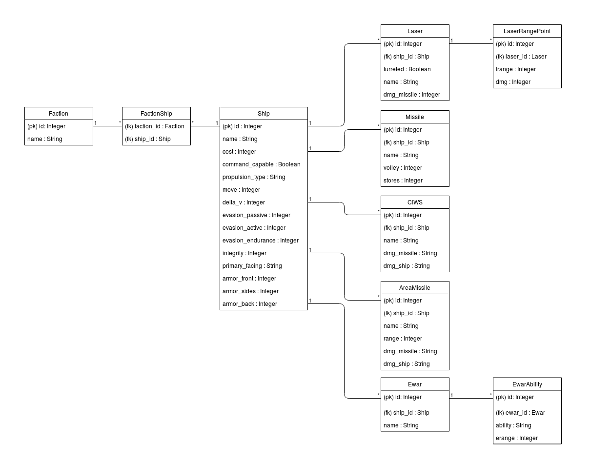

# Database description

The program is set to use an SQLite database when ran locally, and PostgreSQL when deployed on Heroku. SQL statements compatible
with both are generated by SQLAlchemy.

## Database structure



## Database tables

The table creation statements are documented here. It would be beneficial for these tables to make use of inheritance in many cases,
in particular for a base table which contains the object's primary key and name, and for weapons which all share some common features.
This is currently not the case due to issues I have with implementing it with SQLAlchemy. (It would be straightforward were I working
with SQL statements manually.)

All tables currently conform to the third normal form.

### account

This is the table for user accounts. The account table has modification and creation columns that are not currently used by the program,
but which may prove useful later.
The column *is_admin* is constrained to the values 0 and 1 which are used as boolean values by the program.

```
CREATE TABLE account (
        id INTEGER NOT NULL,
        date_created DATETIME,
        date_modified DATETIME,
        name VARCHAR(144) NOT NULL,
        username VARCHAR(144) NOT NULL,
        password VARCHAR(144) NOT NULL,
        is_admin BOOLEAN NOT NULL,
        PRIMARY KEY (id),
        CHECK (is_admin IN (0, 1))
)
```

### faction

This is the table for factions. *faction* has a many-to-many relation to *ship*.

```
CREATE TABLE faction (
        id INTEGER NOT NULL,
        name VARCHAR(256) NOT NULL,
        PRIMARY KEY (id)
)
```

### ship

This is the table for ships.
The column *command_capable* is constrained to the values 0 and 1 which are used as boolean values by the program.
*ship* has a many-to-many relation to *faction*.

```
CREATE TABLE ship (
        id INTEGER NOT NULL,
        name VARCHAR(256) NOT NULL,
        cost INTEGER NOT NULL,
        command_capable BOOLEAN NOT NULL,
        propulsion_type VARCHAR(256) NOT NULL,
        move INTEGER NOT NULL,
        delta_v INTEGER NOT NULL,
        evasion_passive INTEGER NOT NULL,
        evasion_active INTEGER NOT NULL,
        evasion_endurance INTEGER,
        integrity INTEGER NOT NULL,
        primary_facing VARCHAR(256) NOT NULL,
        armor_front INTEGER NOT NULL,
        armor_sides INTEGER NOT NULL,
        armor_back INTEGER NOT NULL,
        PRIMARY KEY (id),
        CHECK (command_capable IN (0, 1))
)
```

### factionship

This is the association table for the many-to-many relation between ship and faciton

```
CREATE TABLE factionship (
        faction_id INTEGER NOT NULL,
        ship_id INTEGER NOT NULL,
        PRIMARY KEY (faction_id, ship_id),
        FOREIGN KEY(faction_id) REFERENCES faction (id),
        FOREIGN KEY(ship_id) REFERENCES ship (id)
)
```

### Weapon tables

All weapon tables have a one-to-one relation to *ship*. The foreign key used for this relation has an index, as
retrieving the weapons which belong to a particular ship is a common query.

#### laser

This is the table for laser weapons. In the future (outside the scope of the project as coursework), laser range and anti-ship
damage data for a given range will be contained in a separate table with a many-to-one relationship to *laser*.

```
CREATE TABLE laser (
        id INTEGER NOT NULL,
        name VARCHAR(256) NOT NULL,
        laser_dmg_missile VARCHAR(256) NOT NULL,
        ship_id INTEGER NOT NULL,
        PRIMARY KEY (id),
        FOREIGN KEY(ship_id) REFERENCES ship (id)
)

CREATE INDEX ix_laser_ship_id ON laser (ship_id)
```

#### missile

This is the table for missile weapons.

```
CREATE TABLE missile (
        id INTEGER NOT NULL,
        name VARCHAR(256) NOT NULL,
        volley INTEGER NOT NULL,
        stores INTEGER NOT NULL,
        ship_id INTEGER NOT NULL,
        PRIMARY KEY (id),
        FOREIGN KEY(ship_id) REFERENCES ship (id)
)

CREATE INDEX ix_missile_ship_id ON missile (ship_id)
```

#### CIWS

This is the table for CIWS weapons.

```
CREATE TABLE "CIWS" (
        id INTEGER NOT NULL,
        name VARCHAR(256) NOT NULL,
        dmg_missile VARCHAR(256) NOT NULL,
        dmg_ship VARCHAR(256) NOT NULL,
        ship_id INTEGER NOT NULL,
        PRIMARY KEY (id),
        FOREIGN KEY(ship_id) REFERENCES ship (id)
)

CREATE INDEX "ix_CIWS_ship_id" ON "CIWS" (ship_id)
```

#### area_missile

This is the table for area missile weapons.

```
CREATE TABLE area_missile (
        id INTEGER NOT NULL,
        name VARCHAR(256) NOT NULL,
        am_range INTEGER NOT NULL,
        dmg_missile VARCHAR(256) NOT NULL,
        dmg_ship VARCHAR(256) NOT NULL,
        ship_id INTEGER NOT NULL,
        PRIMARY KEY (id),
        FOREIGN KEY(ship_id) REFERENCES ship (id)
)

CREATE INDEX ix_area_missile_ship_id ON area_missile (ship_id)
```

#### ewar

This is the table for ewar suites.

```
CREATE TABLE ewar (
        id INTEGER NOT NULL,
        name VARCHAR(256) NOT NULL,
        ship_id INTEGER NOT NULL,
        PRIMARY KEY (id),
        FOREIGN KEY(ship_id) REFERENCES ship (id)
)

CREATE INDEX ix_ewar_ship_id ON ewar (ship_id)
```


